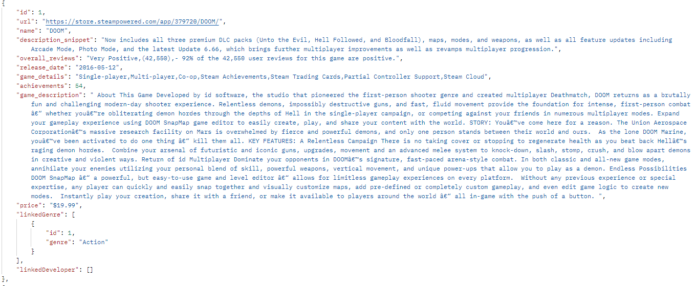

# **_Projekt SteamGamesAPI_**

### **Projektname:**: SteamGamesAPI
### **Lernender:** [Robin Rupp]

### **Projektbeschreibung**:

Von eine CSV Datei mir rund 400K Games on Data, wird die API dem User helfen nach den Richtigen Game suchen. Von «Name» bis «erschein Datum», du kannst die Games Bibliothek dursuchen.

### Fazit
Diese hat mir Viel spass gemacht zu machen, aber ich würde sagen weniger als das Game.
Dieses Projekt hat mir das API schreiben in Kopf gepacked and bleibt jetzt da. ich hab viel gelernt.

